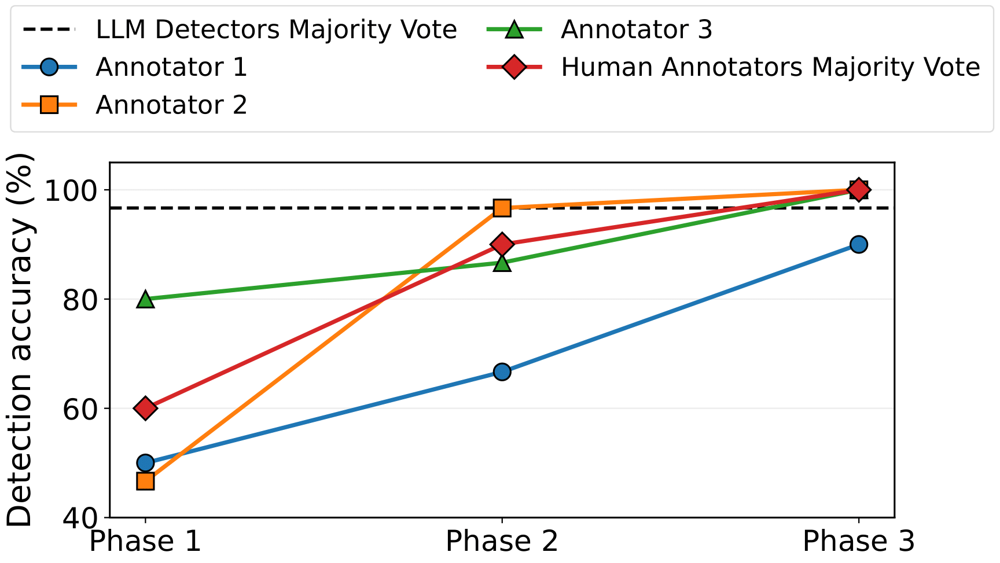
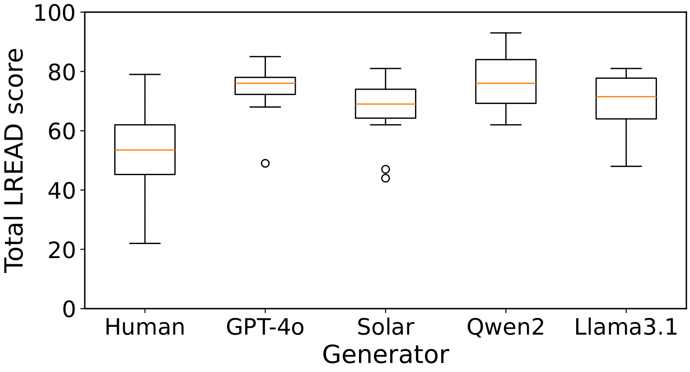
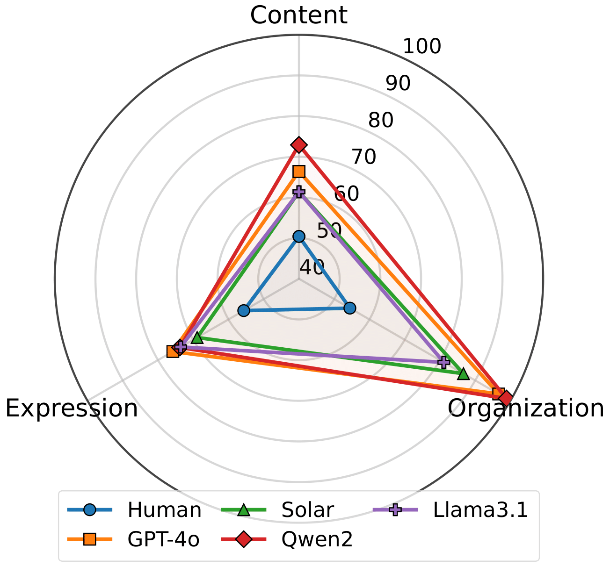
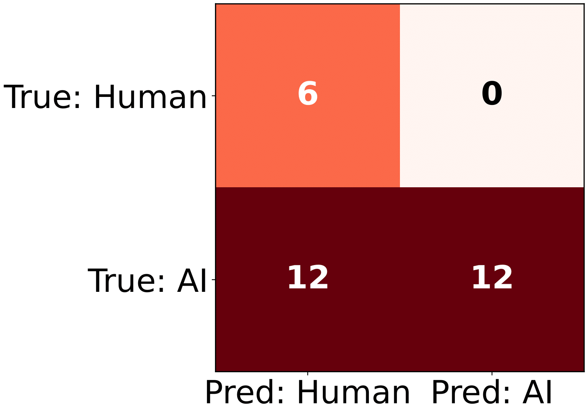
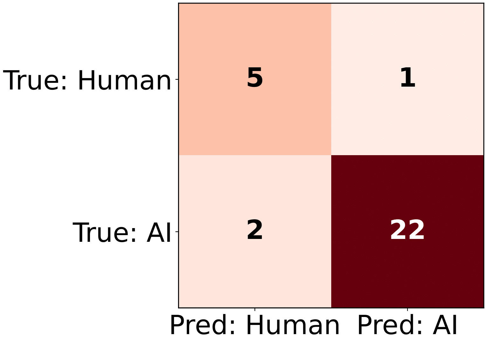

# From Intuition to Expertise: Rubric-Based Cognitive Calibration for Human Detection of LLM-Generated Korean Text

This repository releases the **Phase 1–3 evaluation datasets** and the **LREAD rubric** introduced in the paper  
*From Intuition to Expertise: Rubric-Based Cognitive Calibration for Human Detection of LLM-Generated Korean Text*.

The released resources support the empirical investigation of **human-authored vs. LLM-generated Korean text detection by human experts** as a **structured, explicit, and learnable cognitive process**, rather than as an innate or purely intuitive skill.

---

# What This Repository Provides

This repository provides materials for **evaluation, analysis, and methodological replication** of a human-centered framework for authorship attribution under LLM text generation.

Specifically, it includes:
- **Phase 1–3 argumentative essay datasets**, annotated with ground-truth authorship labels
- **LREAD (Linguistically-Regularized Expert AI Detection)** rubric, released in both Korean (original) and English (translated) forms
- Empirical artifacts documenting how expert judgment evolves through rubric-guided cognitive calibration

---

# Motivation

Recent large language models (LLMs) generate Korean text that is highly fluent and norm-conforming.  
As a result, even linguistically trained experts often rely on surface-level well-formedness, rendering initial judgments vulnerable to a persistent **fluency trap**, in which stylistic polish obscures synthetic origin.

This work demonstrates that detection failures arise not from insufficient linguistic competence, but from the absence of an **explicit, shared, and operationalized decision procedure** for authorship attribution.

---

# Core Idea: LREAD and Cognitive Calibration

We propose **LREAD (Linguistically-Regularized Expert AI Detection)**, a rubric derived from national Korean writing assessment standards and reconfigured to surface **micro-level linguistic cues** that are systematically underweighted by intuitive judgment.

These cues include:
- Punctuation usage 
- Spacing and orthographic conventions  
- Register consistency and translationese  
- Creativity 

LREAD is operationalized through a **three-phase longitudinal cognitive calibration protocol**:

| Phase | Cognitive mode | Primary objective |
|------|---------------|-------------------|
| Phase 1 | Intuition-only | Measure baseline vulnerability to fluency |
| Phase 2 | Rubric-guided | Enforce criterion-level analytic reasoning |
| Phase 3 | Calibrated mastery | Demonstrate rubric-internalized expert judgment |

---

# Detection Outcomes Across Phases

<p align="center">
  
</p>

**Figure 1. Detection accuracy across phases.**  
Detection accuracy for individual human annotators, the human majority vote, and a zero-shot LLM-detector majority baseline across the three experimental phases.  
Phase 1 exhibits substantial inter-annotator variance, reflecting reliance on idiosyncratic intuition.  
Phase 2 shows rapid convergence following rubric exposure, indicating that performance gains arise from shared analytic criteria rather than individual learning alone.  
Phase 3 illustrates a stable upper-bound case of rubric-internalized expert judgment within a constrained domain.

---

### Table 1. Phase 1 Detection Accuracy (Intuition-only) 

| Evaluator | Participant | Accuracy (%) |
|----------|-------------|--------------|
| Human | Annotator 1 | 50.00 |
|  | Annotator 2 | 46.67 |
|  | Annotator 3 | 80.00 |
|  | **Human Majority Vote** | **60.00** |
| LLMs | GPT-5.2 Thinking | 96.67 |
|  | Gemini 3 Flash | 96.67 |
|  | Claude Sonnet 4.5 | 90.00 |
|  | **LLMs Majority Vote** | **96.67** |

**Table 1.** Detection accuracy under intuition-only evaluation (Phase 1).  
Human experts exhibit substantial variance and a low majority-vote accuracy, reflecting reliance on heterogeneous intuitive heuristics.  
In contrast, zero-shot LLM-based reviewers achieve high apparent accuracy by exploiting surface-level regularities.  
This contrast underscores that early human failure reflects the absence of an explicit decision procedure rather than inferior access to fluency cues.

---

### Table 4. Inter-Annotator Agreement Across Phases (Human Annotators)

| Phase | Fleiss’ κ |
|------|-----------|
| Phase 1 | -0.09 |
| Phase 2 | 0.24 |
| Phase 3 | 0.82 |

**Table 4.** Inter-annotator agreement measured using Fleiss’ κ **among human annotators only** across phases.  
Agreement is near chance in Phase 1, reflecting heterogeneous and weakly aligned intuitive criteria.  
Rubric-guided calibration substantially improves agreement in Phase 2, while Phase 3 demonstrates near-expert consensus under rubric-internalized judgment.

Together, Figure 1, Table 1, and Table 4 show that **cognitive calibration improves not only accuracy but also reliability**, transforming authorship attribution from an idiosyncratic judgment task into a shared analytic process.

---

# Overall LREAD Score Distributions (Phase 2)

<p align="center">
  
</p>

**Figure 2. Distribution of total LREAD scores by generator (Phase 2).**  
Boxplots summarize total LREAD scores assigned to human- and LLM-generated essays.  
While LLM outputs frequently attain high aggregate scores—often overlapping with or exceeding human medians—their distributions exhibit reduced dispersion, reflecting structural regularity.  
Human essays display broader variance, consistent with localized creativity and deviation treated as diagnostically informative rather than noise.

---

# Dimension-level Profiles (Phase 2)

<p align="center">
  
</p>

**Figure 3. Dimension-level LREAD profiles across generators.**  
Radar plots decompose total scores into Content, Organization, and Expression components.  
LLM-generated texts cluster near the upper bound of Organization, reflecting strong template adherence and structural completeness.  
In contrast, divergences emerge in Content depth and Expression naturalness, where over-regularization and translationese artifacts are more salient relative to human writing.

---

# Confusion Patterns Under Calibration

<p align="center">
  
</p>

**Figure 4. Confusion matrix under intuition-only judgment (Phase 1).**  
Under intuition-only evaluation, a high rate of false negatives is observed, with LLM-generated essays frequently misclassified as human-authored.  
This pattern exemplifies the fluency trap, wherein polished and norm-conforming texts evade intuitive detection.

<p align="center">
  
</p>

**Figure 5. Confusion matrix under rubric-guided judgment (Phase 2).**  
Rubric-guided evaluation substantially reduces false negatives and increases inter-annotator agreement.  
The shift indicates that calibration redirects attention from global fluency to diagnostically meaningful local linguistic cues.

---

## Released Data

### Repository Structure

```
.
├── Phase_1/
│   ├── Elementary/
│   ├── Middle/
│   └── High/
├── Phase_2/
│   ├── Elementary/
│   ├── Middle/
│   ├── High/
└── Phase_3/
    └── Elementary/
```

### Essay Files
- **Format:** HTML  
- **Genre:** Argumentative essays  
- **Educational levels:** Elementary, Middle, and High school  

### Ground-truth Labels
Each dataset directory includes a `Ground_Truth.txt` file specifying whether each essay was authored by:
- Human
- GPT-4o
- Solar
- Qwen2
- Llama3.1

---

## LREAD Rubric

The complete rubric is released in both languages:
- `LREAD_Rubric_Korean.xlsx`  
- `LREAD_Rubric_English_Translated.xlsx`  

---

## Citation

```bibtex

```
