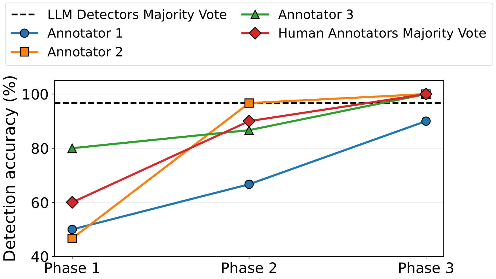
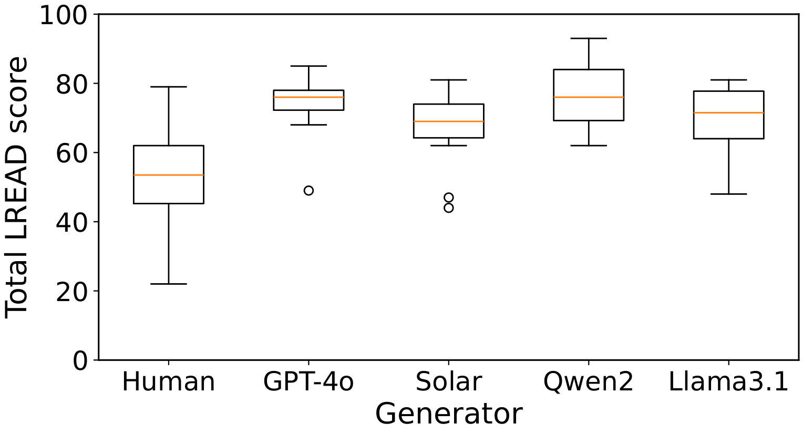
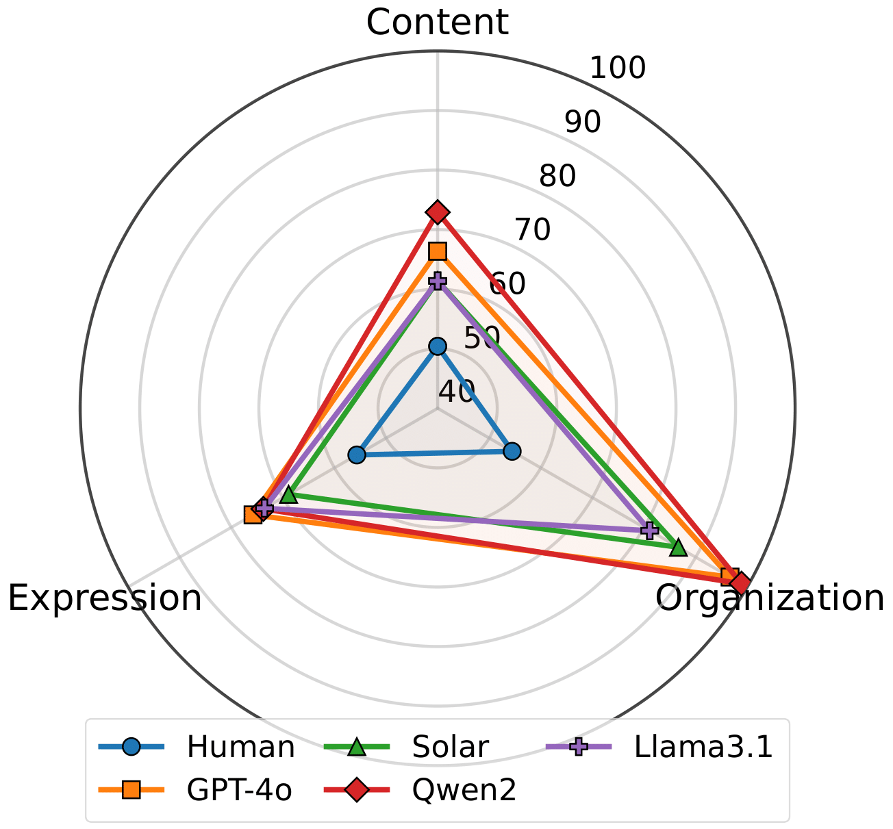
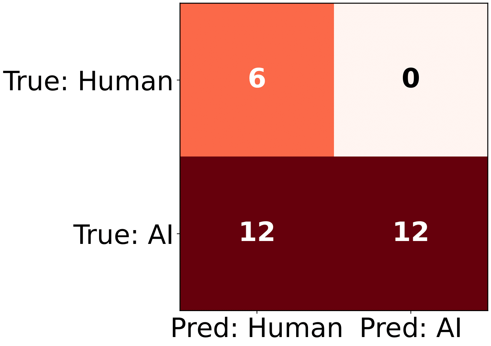
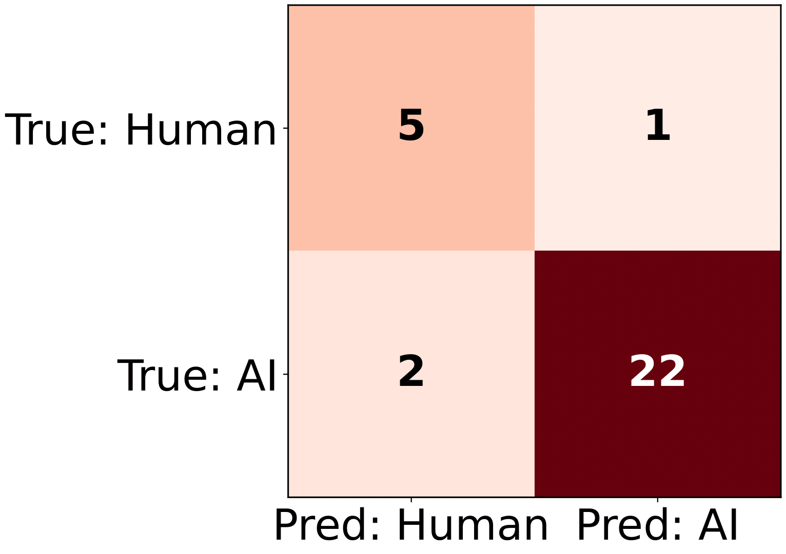

# From Intuition to Calibrated Judgment: A Rubric-Based Expert-Panel Study of Human Detection of LLM-Generated Korean Text

This repository releases the **Phase 1–3 evaluation datasets** and the **LREAD rubric** introduced in the paper  
*From Intuition to Calibrated Judgment: A Rubric-Based Expert-Panel Study of Human Detection of LLM-Generated Korean Text*.

The released resources support the empirical study of **human attribution of Korean LLM-generated text** as a **structured, auditable, and learnable evaluation procedure**, rather than as a fixed or purely intuitive skill.

---

# What This Repository Provides

This repository provides materials for **evaluation, analysis, and methodological replication** of a human-centered framework for authorship attribution under LLM text generation.

Specifically, it includes:
- **Phase 1–3 argumentative essay datasets**, annotated with ground-truth authorship labels
- **LREAD (Linguistically-Regularized Expert AI Detection)** rubric, released in both Korean (original) and English (translated) forms
- Empirical artifacts documenting how rubric-guided calibration reshapes human attribution across the three phases

---

# Motivation

Recent large language models generate Korean text that is highly fluent and norm-conforming.  
As a result, even linguistically trained readers can over-rely on surface-level well-formedness, creating a persistent **fluency trap** in which stylistic polish obscures synthetic origin.

This work argues that early detection failure does not primarily reflect a lack of linguistic competence.  
Rather, it reflects the absence of an **explicit, shared, and operationalized decision procedure** for authorship attribution.

---

# Core Idea: LREAD and Cognitive Calibration

We introduce **LREAD (Linguistically-Regularized Expert AI Detection)**, a Korean-specific rubric derived from national Korean writing standards and adapted for **human-centered attribution**.

LREAD is designed to surface **micro-level linguistic cues** that intuition alone tends to underweight, including:
- Punctuation behavior
- Spacing and orthographic conventions
- Register stability and natural Korean phrasing
- Translationese-sensitive cues
- Creativity as a secondary but meaningful discriminator

LREAD is operationalized through a **three-phase longitudinal calibration protocol**:

| Phase | Cognitive mode | Primary objective |
|------|---------------|-------------------|
| Phase 1 | Intuitive baseline | Measure baseline susceptibility to the fluency trap and elicit early cue candidates |
| Phase 2 | Criterion-anchored analysis | Apply the rubric with explicit scoring and justification |
| Phase 3 | Internalized application | Evaluate internalized criteria on a limited held-out elementary-persona subset |

---

# Detection Outcomes Across Phases

<p align="center">
  
</p>

**Figure 1. Detection accuracy across phases.**  
Detection accuracy for individual human annotators, the human majority vote, and a zero-shot LLM-detector majority baseline across the three experimental phases.  
Phase 1 shows substantial inter-annotator variance, reflecting reliance on heterogeneous intuition under blind judgment.  
Phase 2 shows strong improvement after rubric introduction, indicating that performance gains arise from criterion-anchored analysis rather than from repeated exposure alone.  
Phase 3 provides encouraging small-set evidence of successful internalized application on a limited held-out elementary-persona subset.

---

### Table 1. Phase 1 Detection Accuracy (Intuition-only)

| Evaluator | Participant | Accuracy (%) |
|----------|-------------|--------------|
| Human | Annotator 1 | 50.00 |
|  | Annotator 2 | 46.67 |
|  | Annotator 3 | 80.00 |
|  | **Human Majority Vote** | **60.00** |
| LLMs | GPT-5.2 Thinking | 96.67 |
|  | Gemini 3 Flash | 96.67 |
|  | Claude Sonnet 4.5 | 90.00 |
|  | **LLMs Majority Vote** | **96.67** |

**Table 1.** Detection accuracy under intuition-only evaluation (Phase 1).  
Human annotators exhibit substantial variance and a relatively weak majority-vote baseline, indicating that linguistically informed intuition alone is insufficiently stable for reliable attribution.  
By contrast, zero-shot LLM reviewers achieve high apparent accuracy on the same items, motivating the need for an explicit and auditable human calibration procedure rather than suggesting that human evaluation is inherently uninformative.

---

### Table 4. Inter-Annotator Agreement Across Phases (Human Annotators)

| Phase | Fleiss’ κ |
|------|-----------|
| Phase 1 | -0.09 |
| Phase 2 | 0.24 |
| Phase 3 | 0.82 |

**Table 4.** Inter-annotator agreement measured using Fleiss’ κ among human annotators across phases.  
Agreement is near chance in Phase 1, reflecting weakly aligned intuitive criteria.  
Rubric-guided calibration improves agreement in Phase 2, while Phase 3 shows strong agreement on the limited held-out subset.  
Taken together, Figure 1, Table 1, and Table 4 suggest that rubric-based calibration improves both attribution accuracy and panel-level reliability.

---

# Overall LREAD Score Distributions (Phase 2)

<p align="center">
  
</p>

**Figure 2. Distribution of total LREAD scores by generator (Phase 2).**  
Boxplots summarize total LREAD scores assigned to human- and LLM-generated essays.  
Several LLM sources attain high aggregate scores and often overlap with or exceed human medians on formal rubric dimensions.  
At the same time, human essays display broader variance, consistent with localized creativity, developmental irregularity, and non-formulaic realization that remain diagnostically informative under calibration.

---

# Dimension-level Profiles (Phase 2)

<p align="center">
  
</p>

**Figure 3. Dimension-level LREAD profiles across generators.**  
Radar plots decompose total scores into Content, Organization, and Expression components.  
LLM-generated texts cluster near the upper bound of Organization, reflecting strong template adherence and structural completeness.  
By contrast, differences become more visible in Expression and parts of Content, where over-regularization, register stability, and translationese-sensitive distortions are more salient relative to human writing.  
This pattern reinforces the paper’s central claim that surface correctness can be a misleading signal of human authorship.

---

# Confusion Patterns Under Calibration

<p align="center">
  
</p>

**Figure 4. Confusion matrix under intuition-only judgment (Phase 1).**  
Under intuition-only evaluation, a high false-negative rate is observed, with many LLM-generated essays misclassified as human-authored.  
This pattern exemplifies the fluency trap, in which polished and norm-conforming machine-generated texts evade intuitive detection.

<p align="center">
  
</p>

**Figure 5. Confusion matrix under rubric-guided judgment (Phase 2).**  
Rubric-guided evaluation sharply reduces false negatives while introducing only limited false positives.  
This shift indicates that calibration redirects attention away from global fluency and toward more stable diagnostic cues grounded in spacing, punctuation, register, and persona fidelity.

---

## Released Data

### Repository Structure

```
.
├── Phase_1/
│   ├── Elementary/
│   ├── Middle/
│   └── High/
├── Phase_2/
│   ├── Elementary/
│   ├── Middle/
│   ├── High/
└── Phase_3/
    └── Elementary/
```

### Essay Files
- **Format:** HTML  
- **Genre:** Argumentative essays  
- **Educational levels:** Elementary, Middle, and High school  

### Ground-truth Labels
Each dataset directory includes a `Ground_Truth.txt` file specifying whether each essay was authored by:
- Human
- GPT-4o
- Solar
- Qwen2
- Llama3.1

---

## LREAD Rubric

The complete rubric is released in both languages:
- `LREAD_Rubric_Korean.xlsx`  
- `LREAD_Rubric_English_Translated.xlsx`  

---

## Citation

```text
@misc{park2026intuitioncalibratedjudgmentrubricbased,
      title={From Intuition to Calibrated Judgment: A Rubric-Based Expert-Panel Study of Human Detection of LLM-Generated Korean Text}, 
      author={Shinwoo Park and Yo-Sub Han},
      year={2026},
      eprint={2601.19913},
      archivePrefix={arXiv},
      primaryClass={cs.CL},
      url={https://arxiv.org/abs/2601.19913}, 
}
```
